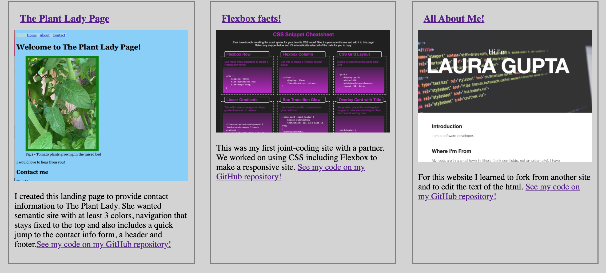

# resumepage

This site is to showcase my work so far. It is a responsive site using a lot of CSS including flexbox and styling for media screens. There are lots of links and screenshots to showcase some of the sites I have done so far. Navigation links jump to the corresponding sections on the page. My most recent refactoring project is highlighted on the page with a larger section and photo for emphasis. I also updated my resume to emphasize my new carreer path. 

## Features
Here are some screenshots of the way the site is responsive... 

## Built With

* [HTML](https://developer.mozilla.org/en-US/docs/Web/HTML)
* [CSS](https://developer.mozilla.org/en-US/docs/Web/CSS)

## Deployed Link

* [See Live Site](#https://lauragupta.github.io/resumepage/#contact-info)

## Authors

* **Laura Gupta** 

- [Link to Portfolio Site](#https://lauragupta.github.io/resumepage/#contact-info)
- [Link to Github](https://github.com/lauragupta)
- [Link to LinkedIn](https://www.linkedin.com/in/laura-gupta-5a277158/)

## License
MIT License

Copyright (c) [2021] [Laura Gupta]

Permission is hereby granted, free of charge, to any person obtaining a copy of this software and associated documentation files (the "Software"), to deal in the Software without restriction, including without limitation the rights to use, copy, modify, merge, publish, distribute, sublicense, and/or sell copies of the Software, and to permit persons to whom the Software is furnished to do so, subject to the following conditions:

The above copyright notice and this permission notice shall be included in all copies or substantial portions of the Software.

THE SOFTWARE IS PROVIDED "AS IS", WITHOUT WARRANTY OF ANY KIND, EXPRESS OR IMPLIED, INCLUDING BUT NOT LIMITED TO THE WARRANTIES OF MERCHANTABILITY, FITNESS FOR A PARTICULAR PURPOSE AND NONINFRINGEMENT. IN NO EVENT SHALL THE AUTHORS OR COPYRIGHT HOLDERS BE LIABLE FOR ANY CLAIM, DAMAGES OR OTHER LIABILITY, WHETHER IN AN ACTION OF CONTRACT, TORT OR OTHERWISE, ARISING FROM, OUT OF OR IN CONNECTION WITH THE SOFTWARE OR THE USE OR OTHER DEALINGS IN THE SOFTWARE.

## Acknowledgments

* Garrett Corbin really went the extra mile on our collaboration site, to make the flexbox on the site make a big impression. Thanks for all your work and dedication! 
